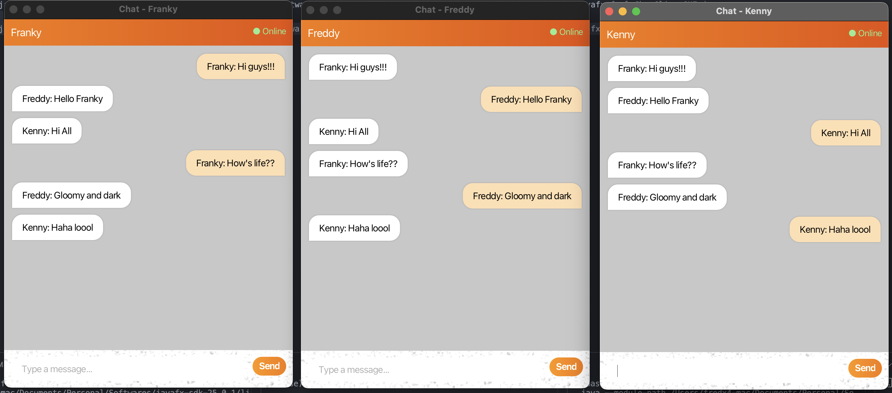

# FXConnect : JavaFX Real-Time Chat Application (Sockets + Multithreading)

A modern real-time chat application built using JavaFX, Java Sockets, and Multithreading.
This project implements a multi-client chat system with a clean UI, smooth animations, and a fully concurrent server.

## ✅ Features

- Multi-user chat (broadcasting)
- Modern JavaFX GUI
- Smooth fade animations for messages
- Login popup for username
- Online status indicator
- Real-time message updates
- Multi-threaded server
- Lightweight & fast

## ✅ Client UI

## ✅ How It Works

### 🖥️ Server

- Runs on port 1234
- Accepts multiple clients
- Creates a new thread per client (ClientHandler)
- Broadcasts messages to all other clients
- Logs connects, disconnects, and all chat activity

### 💬 Client (JavaFX GUI)

- User enters a username at startup
- Styled chat bubbles for each message
- Scrollable chat area
- “Send” button + Enter key support
- Background thread listens for server messages
- GUI updates using Platform.runLater()

## ✅ Requirements
- JDK	17 or higher
- JavaFX SDK	17+
- IDE	IntelliJ / VS Code / Eclipse
- OS	Windows / macOS / Linux

## ✅ Setup Instructions
1️⃣ Download JavaFX

Download from:
https://openjfx.io/

Extract and note the path:
/path/to/javafx-sdk/lib

## ✅ Running the Project

2️⃣ Run the Server
javac Server.java  
java Server

Server Output Example:

Server started on port 1234

3️⃣ Run the Client (JavaFX GUI)

## ✅ Compile

javac --module-path "/path/to/javafx/lib" --add-modules javafx.controls ChatClientGUI.java

## ✅ Run

java --module-path "/path/to/javafx/lib" --add-modules javafx.controls ChatClientGUI

## ✅ Run multiple clients

Open 2–3 new terminals and run the same client command.  
Each client will receive messages in real time.

## ✅ Demo Flow

1. Start the server

2. Launch Client 1 → enter username → chat

3. Launch Client 2 → enter username → see both chats in sync

4. Send messages from both

5. Observe server logging realtime activity

6. Close a client → server logs disconnect

## ✅ Troubleshooting

1. JavaFX components missing?

Add module path correctly:

--module-path "/path/to/javafx/lib" --add-modules javafx.controls

2. Client fails to connect?

Check if server is running:

java Server

3. Port already in use?

Change port number in:

private static final int PORT = 1234;

## ✅ Author

Franklin Jetty Johnson    
Full Stack Developer  
IIT Guwahati X DS  
VIT Vellore X MCA  
Kerala, India  

## ✅ License

This project is open-source and free to use.